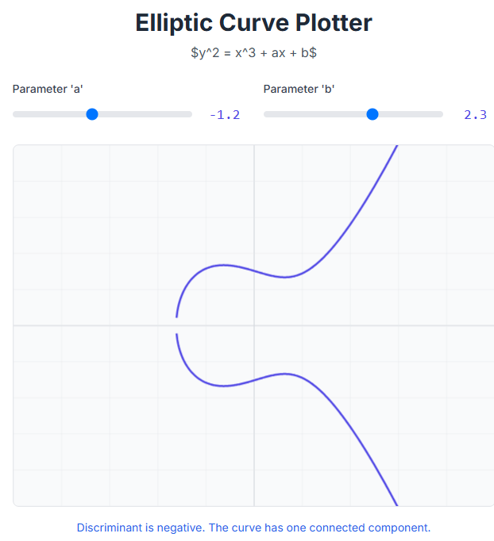
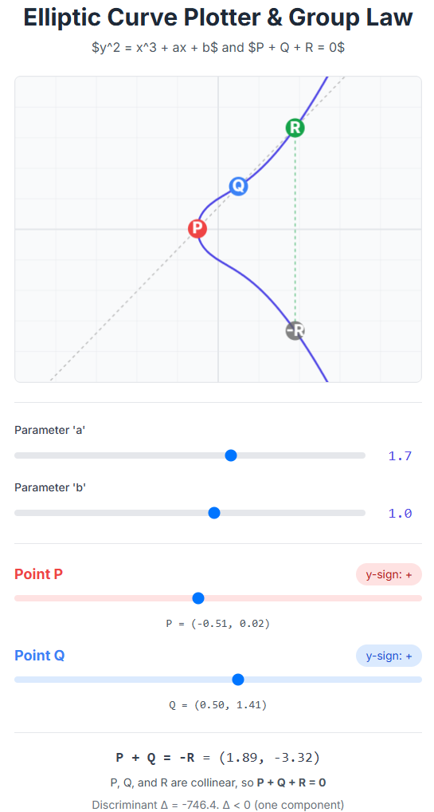
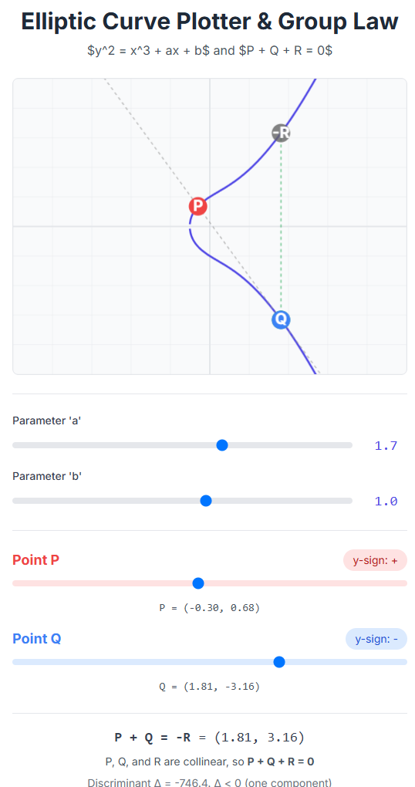
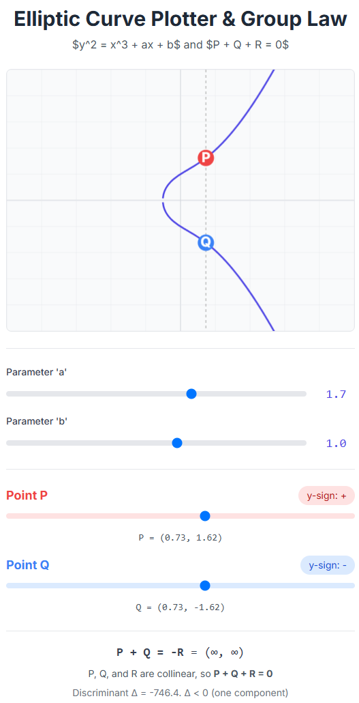
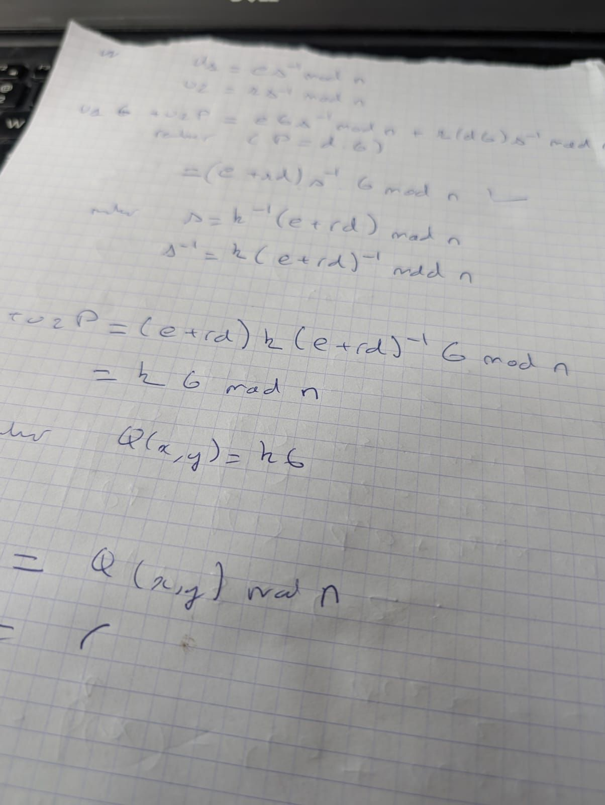

# MPC + ZKP Maths Step-By-Step

## Intro

In order to understand the maths behind MPC and ZKP, we first need to understand Elliptic Curve Cryptography.
There are many tutorials out there, this is just another one.
My motto, teach yourself, teach others. Learning by doing.

Please double-check the maths!!!!

(PS: using this [cheat sheet](https://www.upyesp.org/posts/makrdown-vscode-math-notation/)) for this doc.

## Elliptic Curve Crypto (ECC)

An elliptic curve is given by the equation $y^2 = x^3 + a.x + b \mod p$



$p$ is a large prime number. (There are lots of interesting algos to generate a probable large prime number, but we will keep things simple here).

We now need to define some comvention about specific points on the curve, we will call them $P, Q, R$.

- $P + Q + R = 0$
- $P + Q + Q = 0$
- $P + Q + 0 = 0$
- $P + P + 0 = 0$

For example, 



shows $P + Q + R = 0$ - meaning the 3 points are colinear.

Or,



shows $P + Q + Q = 0$.

Or,



shows $P + Q + 0 = 0$

You can play with an interactive version of this [here](https://g.co/gemini/share/a6a1a03b45d6) or [there](./code/curve.htm)

Then we need to select specific points on thr curve that form a [Cyclic Group](https://en.wikipedia.org/wiki/Cyclic_group).
In plain english, all elements from the group composed of primitive elements and other points, has a characteristic such that a primitive point, can, by adding itself, can enumerate all elements from the group. (For example, if 1 is a primitive, by adding itself, it enumerates all integers).

This primitive element is therefore known as a Generator Point in a cyclic group as it can generate all points in the group.

**Generator G**: This is the base point defined in the curve parameters. Every public key is computed as $P = 𝑑 . 𝐺$ where $𝑑$ is the private key.

The following [code](./code/pub_pri.py) show how to generate an ECC public private key pair - and also prints the value of G (x, y):

```python
from cryptography.hazmat.primitives.asymmetric import ec
from cryptography.hazmat.backends import default_backend
from ecdsa.curves import NIST256p

# Generate ECC key pair using SECP256R1 (also known as prime256v1)
private_key = ec.generate_private_key(ec.SECP256R1(), default_backend())
public_key = private_key.public_key()

# Display private key scalar (d)
private_value = private_key.private_numbers().private_value
print("Private Key (d):")
print(f"  d = {hex(private_value)}")

# Display public key point (Q = d*G)
public_numbers = public_key.public_numbers()
print("\nPublic Key (Q = d * G):")
print(f"  x = {hex(public_numbers.x)}")
print(f"  y = {hex(public_numbers.y)}")

# Get the Generator G from the curve using ecdsa (for direct G access)
curve = NIST256p
G = curve.generator
print("\nGenerator Point G (from NIST256p):")
print(f"  x = {G.x()}")
print(f"  y = {G.y()}")

```

Gives for G:
```text
Generator Point G (from NIST256p):
  x = 48439561293906451759052585252797914202762949526041747995844080717082404635286
  y = 36134250956749795798585127919587881956611106672985015071877198253568414405109
```

Adding G to itself means that on the curve, you will jump from one point to another and ultimately come back to the original point.

The goal is to construct a group with an element count of $2^{100}$ which is considered secure against brute-force attacks.

Remember  $y^2 = x^3 + a.x + b \mod p$, $p$ being the prime number, if $p$ is 160 bits, the group will contain $2^{160}$ (1461501637330902918203684832716283019655932542976) elements.

$P = 𝑑 . 𝐺$ : G is the generator point, and $𝑑$ is the private key, $(G, P)$ is the public key.

When you give away the public key, because $p$ is a large prime, it gives nothing about how many times you jump on the curve.

## Discrete logarithms
Another way to explain this mathematical concept, imagine:

- $p$ a large prime number
- $g$ a generator as defined above, of a group of integers modulo $p$
- For any number $h$ between $1$ and $p-1$, there exists an integer $x$ such that $g^x \equiv h \mod p$  ($\equiv$ defines congruence) where $x$ is the discrete logarithm of $h$ to base $g$

It is easy to calculate $h$ given $g$, $x$ and $p$ but computationally infeasible to determine $x$ given $g$, $h$, and $p$.

## Signing (ECDSA)

Signing involves the following steps:

1. Get any data - we will call it message $m$
2. Generate $e = H(m)$ where $H$ is a hash function (like SHA-256)
3. Then compute $k$, such that $k = CSPRNG(1, n)$  a cryptographically secure pseudorandom number generator between 1 and n
4. Calculate $Q_{x,y} = k . G$
5. Calculate $r = Q_{x} \mod n$ (if r is 0, go back to step 3)
6. Calculate $s = k^{-1}  (e + r . d) \mod n$ (if s is 0 go back to step 3)

- $P$ is the public key
- $(r, s)$ is the signature

## Verifying (ECDSA)

Verifying involes the following steps:

What is publicly known: $G$ (Generator), $P$ (Public Key), $m$ (message), $(r, s)$ (signature) and $H$ (Hash function):

1. Calculate $u_1 = e . s^{-1} \mod n$
2. Calculate $u_2 = r . s^{-1} \mod n$
3. Calculate $u_1.G + u_2.P = (e + r.d).s^{-1}.G \mod n$ (remember $P = 𝑑 . 𝐺$)
4. Replace $s^{-1}$ knowing $s = k^{-1}  (e + r . d) \mod n$, $s^{-1} = k  (e + r . d)^{-1} \mod n$
5. Then we have $u_1.G + u_2.P = (e + r.d).k.(e+r.d)^{-1}.G \mod n = k.G \mod n$
6. Knowing $Q_{x,y} = k . G$ , we now have $u_1.G + u_2.P = Q_{x,y} \mod n = r$ - checking the consistency of $e, r, s$

## Schnorr Signature

To sign a message $m$:

1. Generate a nonce, a random integer $k$ between $1$ and $q-1$ - same range as the private key
2. Compute a commitment, a value $r = g^k \mod p$
3. Create a challenge $e = H(m||r)$
4. The signature $s = k + x.e \mod p$
5. The final signature is $(r, s)$


## Schnorr Signature Verification

What is public? $y$ is the signer's public key, the message $m$, and the signature $(r, s)$:

1. Calculate the challenge $e = H(m||r)$
2. Verify the equality $g^s \equiv r. y^e \mod p$

# Distributed Key Generation (DKG)

Until now, private keys were generated by a single entity. 
Let's now have a look at the maths behind MPC, starking with DKG.

The concept is to create a split private key what will never be assembled. we will use [CGGMP21](https://eprint.iacr.org/2021/060) as a reference.

There are mulitple splits (2, 3, ..., n) also referred as the signers or parties. We will use the term "party" $p$.

There is a notion of threshold ($t$) as well, which is the minimum number of signatures required to form a valid signed message.

For example, 3 ($t$) out of 5 ($p$) means 3 minimum signers required for 5 parties.

The maths rely on:

- Polynomials over a finite field of degree $t-1$
- Additive property of polynomials resulting, of course, in the same degree of $t-1$

## Step 1: Agreement of public parameters

- All participants $p_i$ agree on a large prime $p$ (which can be $G$ as defined above)
- All calculations are performed modulo $p$ - this is the finite field $Z_p$, the set of integers $0, 1, .., p-1$

## Step 2: Each participant generates a secret polynomial

Each $P_i$ (where $i$ goes from $1$ to $n$) generates a random polynomial $f_i(x)$ of degree $t-1$.
Remember we have $n$ participants and the threshold is set at $t$ with $t <= n$.

The polynomial is:

$f_i(x) = a_{i,0} + a_{i,1}.x + a_{i,2}.x^2 + ... + a_{i,t-1}x^{t-1} \mod p$

The term $a_{i,0}$ is $P_i$'s individual secret contribution.

## Step 3: Shares distribution

Each $P_i$ calculates a share $s_{ij}$ for every other $P_j$, including themselves, by evaluating their own polynomial at participant $j$'s unique index.

$s_{ij} = f_i(j) \mod p$

$P_i$ sends securely $s_{ij}$ to $P_j$.

## Step 4: Creation of the final private key share

Each participant $P_j$ holds the set of shares $s_{1j}, s_{2j}, ..., s_{nj}$

$P_j$ calculates its key share, $sk_j$ by summing all shares received:

$sk_j = \sum_{i=1}^n s_{ij} \mod p$

Conceptually, we have created a master polynomial $F(x)$ which is the sum of all individuals.
The first term (constant) of this $F(x)$ is the shared secret/private key.

$F(x)$ is never calculated or help by a single $P_i$.
Each $P_i$ holds a point to $F(x)$, $sk_j = F(j)$.

For a threshold $t$, participants collaboratively reconstruct the master polynomial F(x) using a technique like Lagrange interpolation and thereby reveal the master secret key.

## Real example with real (small) numbers!

- Let's assume 3 participants, Alice (1), Bob (2) and Charlie (3)
- Let's assume a threshold t of 2, $f(x) = a_0 + a_1.x$
- Alice, Bob and Charlie agree on a large prime $p = 37$ - all calculations will therefore be modulo 37.

### Alice, Bob and Charlie create a secret polynomial

- Alice, $f_1(x) = 5 + 2x$, the secret: $a_{1,0} = 5$.
- Bob, $f_2(x) = 10 + 3x$, the secret: $a_{2,0} = 10$.
- Charlie, $f_3(x) = 8 + x$, the secret: $a_{3,0} = 8$.

### Shares distribution

Each participant now calculates shares for everyone else (including themselves) by evaluating their polynomial at each participant's index (1, 2, 3). All calculations are modulo 37.

- Alice for:
  - herself index = 1: $s_{11} = f_1(1) = 7$
  - Bob index = 2: $s_{12} = f_1(2) = 9$ - sent to Bob
  - Charlie index = 3: $s_{13} = f_1(3) = 11$ - sent to Charlie
- Bob for:
  - Alice index = 1: $s_{21} = f_2(1) = 13$ - sent to Alice
  - himself index = 2: $s_{22} = f_2(2) = 16$
  - Charlie index = 3: $s_{23} = f_2(3) = 19$ - sent to Charlie
- Charlie for:
  - Alice index = 1: $s_{31} = f_3(1) = 9$ - sent to Alice
  - Bob index = 2: $s_{32} = f_3(2) = 10$ - sent to Bob
  - himself index = 3: $s_{33} = f_3(3) = 11$

### Calculation of final key shares

Each participant now sums the shares they have received to get their final private key share $sk_i$.

- Alice: $sk_1 = s_{11} + s_{21} + s_{31} = 7 + 13 + 9 = 29 \mod 37 = 29$
- Bob: $sk_2 = s_{12} + s_{22} + s_{32} = 9 + 16 + 10 = 35 \mod 37 = 35$
- Charlie: $sk_3 = s_{13} + s_{23} + s_{33} = 11 + 19 + 11 = 41 \mod 37 = 4$

- Alice holds 29
- Bob holds 35
- Charlie holds 4

No one knows the final result.

Now, let's double check the final secret can be calculated.

The master secret is the sum of all constants from the polynomials:

$SK = 5 + 10 + 8 = 23$

$F(x) = f_1(x) + f_2(x) + f_3(x) = 23 + 6.x$

Our participants' final shares are just points on this master polynomial:

- Alice's share: $F(1) = 23 + 6 = 29$ : 29 is Alice's share.
- Bob's share: $F(2) = 23 + 6.2 = 35$ : 35 is Bob's share.
- Charlie's share: $F(3) = 23 + 6.3 = 41 \mod 37 = 4$ : 41  is Charlie's share.

Let's now try to reconstruct the secret with just two participants, Alice and Bob.

They have two points on $F(x)$:

- Alice's (index 1) share: $F(1) = 23 + 6 = 29$, so $(1, 29)$
- Bob's (index 2) share: $F(2) = 23 + 6.2 = 35$, so $(2, 35)$

They need to find a line that passe through these two points and find F(0), the secret.

The slope is:

$m = \frac{y_2 - y_1}{x_2 - x_1} = \frac{35 - 29}{2 - 1} = \frac{6}{1} = 6 \mod 37 = 6$

$F(x) = 6.x + b$ - we can use Alice's point $(1, 29)$ to find $b$: $y = F(x) = 29 = 6.1 + b$, therefore $b = 23$

The polynomial is $F(x) = 6.x + 23$ ... $F(0) = 23$ tada!!!

(PS: for higher orders use Lagrange interpolation)

# Distributed Signing

##  Distributed Nonce Generation

This step is almost identical to the initial DKG, but this time the goal is to create a shared secret nonce ($k$), not the long-term private key.

-  A subgroup of at least t participants who are taking part in the signing ceremony (let's call them the signing group) each secretly chooses a random number, $\lambda_j$
-  Each participant $P_j$ in the signing group creates a secret polynomial of degree $t−1$, let's call it $h_j(x)$, where the constant term is their chosen random number: $h_j(0)=\lambda_j$
- Each participant $P_j$ computes shares $\omega_{ji} = h_j(i)$ for every other participant $P_i$ in the signing group and distributes them.
- Each participant $P_i$ sums the shares they received to get their share of the final nonce: $k_i = \sum \omega_{ji}$

The result is that each signing participant $i$ holds a share $k_i$ of a secret nonce $k$.

They also compute the public point R corresponding to this nonce.

$R = \prod R_j = \prod g^{\lambda_j}= g^k $

## Distributed Signature Calculation

- All $P_i$ compute the challenge $e = H(R||PK||m)$ - $R$ the combined public nonce, $PK$ The public key and $m$ the message to sign
- Each $P_i$ computes the partial signature $s_i = k_i + e . sk_i \mod q  $
- The final signature is just the sum of all partial signatures: $s = \sum s_i \mod q$

Voila!

##


[TJ](https://www.linkedin.com/in/tsjanaudy/)

