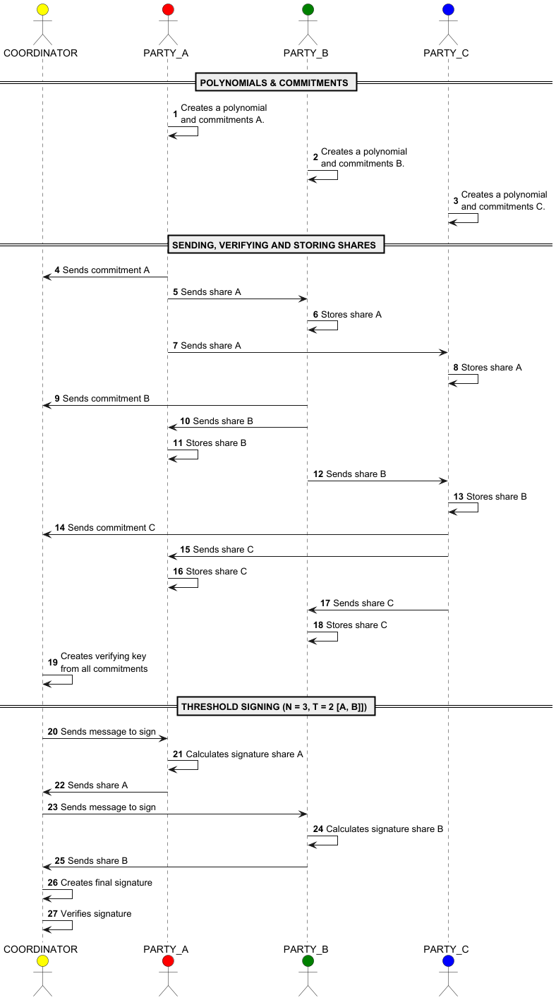

# Partouze Computation

Open Source MPC (Multi-Party Computation) in Python.  
90% done with the help of AI.

## Algorithm

Consider N parties involved and a threshold T.

If N = 5 and T = 2, it means that 2 parties are required to sign the message.

See [the maths](./Gemini/MPC-Maths.pdf)

## Message flow

The following sequence diagram illustrates the flow for N = 3.

